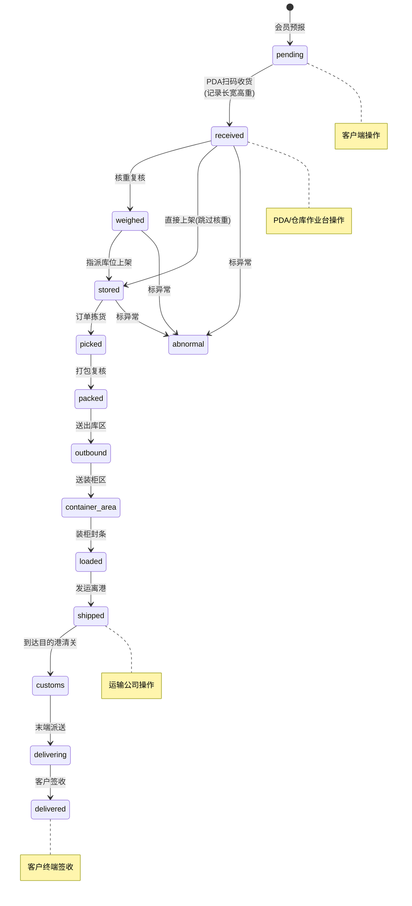
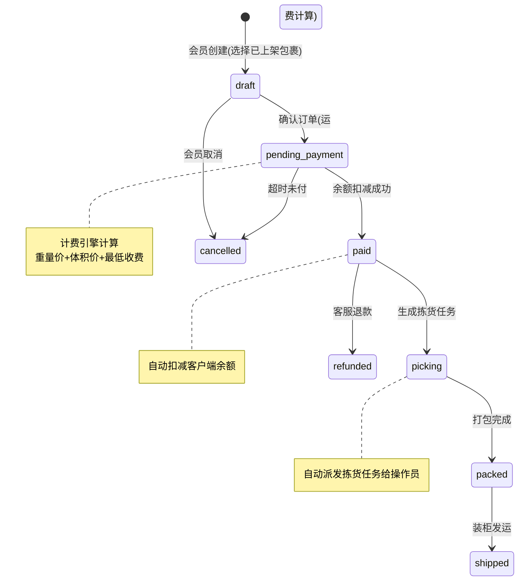

# I56 Framework — 跨境集运 SaaS 系统功能与数据全景分析报告

> **分析对象**: BFT56 八方云仓 (Filament v5.6.6.0, 56 资源, 334 权限项)
> **目标**: 基于 I56 Framework (Go Modular Monolith) 构建企业级跨境物流 SaaS 平台
> **版本**: v1.0 LTS | **日期**: 2026-07-11

---

## 一、业务全景梳理

### 1.1 端到端业务链路

```
┌─────────────┐   ┌─────────────┐   ┌──────────────┐   ┌──────────────┐   ┌─────────────┐
│ 1.包裹预报    │→ │ 2.入库收货   │→ │ 3.上架存储     │→ │ 4.订单创建    │→ │ 5.拣货打包   │
│ (会员/客户端) │   │ (仓库操作员)  │   │ (仓库操作员)    │   │ (会员/客户端)  │   │ (仓库操作员)  │
└─────────────┘   └─────────────┘   └──────────────┘   └──────────────┘   └─────────────┘
                                                                               ↓
┌─────────────┐   ┌─────────────┐   ┌──────────────┐   ┌──────────────┐   ┌─────────────┐
│ 10.客户签收  │← │ 9.末端派送   │← │ 8.清关放行     │← │ 7.海运/空运    │← │ 6.装柜发运   │
│ (收货人)     │   │ (台湾快递)   │   │ (清关公司)     │   │ (运输公司)     │   │ (仓库操作员)  │
└─────────────┘   └─────────────┘   └──────────────┘   └──────────────┘   └─────────────┘
```

### 1.2 角色矩阵

| 角色 | 英文 | 端 | 核心场景 |
|------|------|:--:|------|
| **会员(客户)** | Member | 客户端 | 包裹预报、订单创建、余额充值、地址管理、物流追踪 |
| **客户公司管理员** | ClientAdmin | 客户端 | 会员管理、价格查看、对账确认、API凭证管理 |
| **仓库操作员** | WarehouseOperator | PDA/后台 | 收货入库、上架、拣货、打包、装柜、异常标记 |
| **仓库管理员** | WarehouseManager | 后台 | 仓库配置、库位规划、工单模板、员工调度 |
| **客服** | CustomerService | 后台 | 客户查询、异常处理、包裹认领、通知发送 |
| **财务** | Finance | 后台 | 充值审核、对账、成本录入、利润核算 |
| **公司管理员** | SuperAdmin | 后台 | 系统配置、角色权限、物流API对接、打印模板 |
| **清关公司** | CustomsBroker | API | 清关单生成、清关状态回传 |
| **运输公司** | Carrier | API/Webhook | 运单号生成、物流轨迹推送 |
| **末端派送商** | LastMileCarrier | API | 派送单号获取、签收回传 |

### 1.3 核心业务场景矩阵

| 业务流程 | 触发者 | 关键操作 | 后续动作 |
|------|------|------|------|
| 包裹预报 | 会员 | 填写快递单号+品名+预报仓库 | 系统生成预报记录,等待入库 |
| 入库收货 | 操作员 | 扫码快递单号+测量尺寸/重量 | 包裹状态→已入库,触发通知 |
| 上架存储 | 操作员 | 指派库位 | 包裹状态→已上架,可创建订单 |
| 订单创建 | 会员 | 选择包裹+收件人+运输方式 | 生成集运订单,扣减余额 |
| 拣货打包 | 操作员 | 按订单拣货+复核打包 | 订单状态→已打包,移出库区 |
| 装柜发运 | 操作员 | 订单装入集装柜+封条 | 生成出口报关单,通知承运商 |
| 清关放行 | 清关公司 | 提交清关单 | 清关状态更新,通知客户 |
| 末端派送 | 快递公司 | 生成派送单 | 物流轨迹实时推送 |
| 客户签收 | 收货人 | 确认签收 | 订单完成,触发结算 |

---

## 二、功能模块拆解

### 2.1 一级功能域

```
I56 Framework
├── OMS (订单管理系统)        ← 客户交互核心
├── WMS (仓库管理系统)        ← 操作作业核心
├── TMS (运输管理系统)        ← 物流链路核心
├── CRM (客户管理系统)        ← 客户关系与定价
├── FIN (财务系统)            ← 资金与利润
├── SYS (系统管理)            ← 配置与治理
└── PDA (移动作业端)          ← 仓库操作终端
```

### 2.2 二级功能与依赖关系

```
OMS ──依赖──→ CRM (客户价格)
  │               ↓
  ├── 包裹预报 ──→ WMS (入库)
  ├── 集运订单 ──→ TMS (运输)
  └── 附加服务 ──→ FIN (扣费)

WMS ──依赖──→ SYS (仓库配置)
  │               ↓
  ├── 收货入库 ──→ OMS (更新包裹状态)
  ├── 上架存储 ──→ TMS (库位)
  └── 装柜发运 ──→ TMS (物流追踪)

TMS ──依赖──→ CRM (承运商定价)
  │               ↓
  ├── 线路模板 ──→ OMS (运费计算)
  └── 物流追踪 ──→ FIN (成本核算)

CRM ──独立──
  ├── 客户管理
  ├── 多级定价 (线路价/仓储价/派送费/加收费/附加服务覆盖)
  └── 会员/申报人/地址/余额

FIN ──消费── OMS + TMS
  ├── 应收/应付
  ├── 利润报表 (订单/客户/路线维度)
  └── 月结对账

SYS ──基础设施──
  ├── RBAC + 数据权限 (全部/本仓/本部门/本人)
  ├── 通知中心 (邮件/SMS/Webhook)
  ├── 打印模板 (hiprint引擎)
  ├── 操作审计日志
  ├── API调用日志
  └── PDA版本管理
```

---

## 三、业务逻辑深潜

### 3.1 包裹生命周期（状态机）



#### 包裹异常处理规则

| 异常场景 | 触发条件 | 处理动作 | 恢复路径 |
|------|------|------|------|
| 包裹破损 | 收货时发现外包装破损 | 拍照存证→标记异常→通知客户 | 客户确认→正常入库 或 退货 |
| 货物不符 | 打包复核时发现品名/数量不符 | 标记异常→通知客户→暂存异常区 | 客户确认→修正后继续 |
| 货物缺失 | 拣货时找不到包裹 | 查询库位→全仓搜索 | 找到→继续 或 挂失理赔 |
| 已拒收 | 收货时客户要求拒收 | 标记拒收→联系快递退回 | 退件处理 |

### 3.2 集运订单状态机



#### 合箱策略

| 规则 | 说明 |
|------|------|
| **条件**: 同一会员、同一收件人、同一运输方式、包裹状态均为"已上架" | 才可合箱 |
| **限制**: 单箱最大重量 ≤ 运输方式限重；单边长 ≤ 运输方式限长 | 超过拆分 |
| **定价**: 合箱后按总重量+总体积重新计算，通常比分开寄便宜 | 推荐合并 |
| **附加服务**: 合箱时可选气泡棉包装/加固包装/易碎品贴纸等 | 逐项计费 |

### 3.3 计费规则引擎

#### 四维定价矩阵

```
定价维度: 线路 × 运输方式 × 货物类型 × 税档类型
定价项:   重量单价 + 体积单价 + 最低收费 + 首重/首重价 + 续重价 + 首体积/首体积价 + 续体积价
```

#### 运费计算公式

```
实际重量kg = max(称重重量, 体积重量)
体积重量 = 长cm × 宽cm × 高cm / 抛重系数

IF 运输方式 == '空运':
    抛重系数 = 6000
    IF 货物类型 in ['五类','六类']:
        加收特货附加费 = 基础运费 × 1.5

IF 实际重量 ≤ 首重:
    运费 = max(首重价, 最低收费)
ELSE:
    运费 = 首重价 + CEIL(实际重量 - 首重) × 续重价

IF 运输方式 == '海运' AND 有体积单价:
    体积运费 = 首体积价 + CEIL(总体积 - 首体积) × 续体积价
    运费 = max(重量运费, 体积运费)  // 取较大者

最终运费 = max(运费, 最低收费)
```

#### 三级价格覆盖机制

```
优先级 (高→低):
  客户附加服务覆盖 → 客户线路价 → 线路模板默认价

判断顺序:
1. 查询该客户是否有附加服务覆盖定价 → 有则用客户价
2. 查询该客户是否有线路特价 → 有则用客户线路价
3. 使用线路模板默认价格
```

#### 费用类别

| 费用类别 | 收取对象 | 计算方式 | 触发节点 |
|------|------|------|------|
| 运费 | 会员 | 四维定价 | 创建订单时 |
| 附加服务费 | 会员 | 服务项单价 | 创建订单时 |
| 仓储费 | 会员 | (存储天数-免费天数)×日单价 | 超期后按天计算 |
| 派送费 | 会员 | 承运商×清关点×派送方式×客户价 | 末端派送 |
| 超长/超材/偏远离岛费 | 会员 | 客户加收费覆盖 | 满足条件时附加 |
| 物流成本 | 平台 | 与承运商/清关公司对账 | 运输完成后 |
| 仓储成本 | 平台 | 仓库运营成本 | 内部核算 |

### 3.4 渠道路由逻辑

#### 线路选择算法

```
FUNCTION 推荐线路(包裹列表, 收件地址, 会员偏好):
    1. 获取收件地址所在目标区域(城市→区域组)
    2. 查询支持该区域的线路模板(含运输方式+货物类型+税档)
    3. FOR EACH 包裹:
       识别货物类型(普货/家具/一类～六类/易碎品)
    4. 取所有包裹中最严格的货物类型作为订单货物类型
    5. 筛选支持的运输方式(空运/海运/海快/空运特货)
    6. FOR EACH 可用运输方式:
       计算总运费 = Σ 计费引擎(线路, 运输方式, 货类, 税档, 包裹)
       计算预计天数
    7. 按总运费升序排序, 推荐TOP3线路
    8. 返回: [{线路, 运输方式, 总运费, 预计天数, 税档}]
```

### 3.5 库存管理逻辑

#### 库位编码规则

```
编码格式: {区域编码}-{货架行}-{货架列}
示例: A-01-02 (入库区A, 第1排, 第2列)

上架分配策略:
  同客户包裹→相近库位优先
  同品名包裹→同区不同格
  大件/重货→重型货架区
  小件→小件格区
  易碎品→独立格位(贴易碎标签)
```

### 3.6 消息触发机制

| 触发事件 | 通知方式 | 接收者 | 内容模板 |
|------|------|------|------|
| 包裹入库 | 站内信/邮件 | 会员 | "{tracking_no}已入库,重量{weight}kg" |
| 包裹异常 | 站内信+紧急邮件 | 会员+客服 | "{tracking_no}异常:{reason},请确认" |
| 订单创建 | 站内信 | 会员 | "订单{order_no}已创建,运费¥{amount}" |
| 订单发货 | 站内信+邮件 | 会员 | "订单{order_no}已发运,预计{eta}到达" |
| 清关完成 | 站内信 | 会员 | "订单{order_no}已完成清关" |
| 派送中 | Webhook推送 | 客户端API | 物流轨迹更新 |
| 签收 | 站内信+邮件 | 会员 | "订单{order_no}已签收" |
| 余额不足 | 站内信+短信 | 会员 | "余额¥{balance}不足以支付运费¥{amount}" |
| 月结账单 | 邮件 | 客户公司管理员 | "2026-07对账单,应确认¥{amount}" |

---

## 四、数据字段抽象

### 4.1 包裹 (Parcel)

| 字段 | 类型 | 业务含义 | 示例值 | 必填 |
|------|------|------|------|:--:|
| id | bigint | 主键 | 1001 | ✅ |
| tenant_id | bigint | 租户ID | 1 | ✅ |
| tracking_number | varchar(64) | 快递单号 | "SF1234567890" | ✅ |
| courier_code | varchar(16) | 快递公司编码 | "SF" | |
| warehouse_id | bigint | 预报仓库ID | 1 | ✅ |
| client_id | bigint | 所属客户ID | 100 | ✅ |
| member_id | bigint | 收件会员ID | 101 | |
| product_name | varchar(255) | 品名 | "手机壳" | |
| parcel_name | varchar(255) | 包裹名(客户自定义) | "日用品包裹" | |
| cargo_type | varchar(32) | 货物类型 | "general" | |
| sea_freight_category | varchar(32) | 海运费类(家具/一类~六类) | "class1" | |
| status | varchar(32) | 包裹状态 | "received" | ✅ |
| weight | decimal(10,3) | 重量(kg) | 0.850 | |
| length | decimal(10,2) | 长(cm) | 30.00 | |
| width | decimal(10,2) | 宽(cm) | 20.00 | |
| height | decimal(10,2) | 高(cm) | 12.00 | |
| location_barcode | varchar(64) | 库位编码 | "A-01-02" | |
| photo_url | text | 包裹照片 | "https://..." | |
| remark | text | 备注 | "易碎,请轻放" | |
| receiver_name | varchar(64) | 收件人(快递面单) | "王仁照" | |
| receiver_phone | varchar(32) | 收件人电话 | "886912345678" | |
| abnormal_reason | varchar(64) | 异常原因 | "damaged" | |
| created_at | timestamp | 预报时间 | "2026-07-11T08:30:00Z" | ✅ |
| updated_at | timestamp | 更新时间 | "2026-07-11T15:00:00Z" | ✅ |

### 4.2 集运订单 (Order)

| 字段 | 类型 | 业务含义 | 示例值 | 必填 |
|------|------|------|------|:--:|
| id | bigint | 主键 | 2001 | ✅ |
| order_no | varchar(32) | 订单号 | "20260711001" | ✅ |
| tenant_id | bigint | 租户ID | 1 | ✅ |
| client_id | bigint | 客户ID | 100 | ✅ |
| member_id | bigint | 会员ID | 101 | ✅ |
| route_id | bigint | 线路模板ID | 10 | ✅ |
| transport_type | varchar(16) | 运输方式 | "sea" | ✅ |
| cargo_type | varchar(32) | 货物类型 | "general" | ✅ |
| tax_type | varchar(16) | 税档类型 | "full_inclusive" | ✅ |
| status | varchar(32) | 订单状态 | "paid" | ✅ |
| total_weight | decimal(10,3) | 总重量(kg) | 3.200 | ✅ |
| total_volume | decimal(10,3) | 总体积(才) | 0.150 | |
| weight_price | decimal(10,2) | 重量运费 | ¥48.00 | |
| volume_price | decimal(10,2) | 体积运费 | ¥0.00 | |
| service_fee | decimal(10,2) | 附加服务费 | ¥2.00 | |
| delivery_fee | decimal(10,2) | 派送费 | ¥20.00 | |
| total_amount | decimal(10,2) | 总金额 | ¥70.00 | ✅ |
| cost_amount | decimal(10,2) | 成本金额 | ¥35.00 | |
| profit_amount | decimal(10,2) | 利润 | ¥35.00 | |
| receiver_name | varchar(64) | 收件人 | "王仁照" | ✅ |
| receiver_phone | varchar(32) | 收件人电话 | "886912345678" | ✅ |
| receiver_address | text | 收件地址 | "台北市信义区信义路五段7号101楼" | ✅ |
| carrier_id | bigint | 承运商ID | 1 | |
| customs_broker_id | bigint | 清关公司ID | 1 | |
| customs_number | varchar(64) | 清关单号 | "776XM0005234" | |
| container_no | varchar(32) | 集装柜号 | "TCLU1234567" | |
| seal_no | varchar(32) | 封条号 | "SEAL88901" | |
| tracking_no | varchar(64) | 承运商运单号 | "HCT20260710001" | |
| paid_at | timestamp | 付款时间 | "2026-07-11T09:00:00Z" | |
| shipped_at | timestamp | 发运时间 | "2026-07-14T08:00:00Z" | |
| delivered_at | timestamp | 签收时间 | "2026-07-20T10:00:00Z" | |
| created_at | timestamp | 创建时间 | "2026-07-11T08:30:00Z" | ✅ |
| updated_at | timestamp | 更新时间 | "2026-07-20T10:00:00Z" | ✅ |

### 4.3 客户 (Client)

| 字段 | 类型 | 业务含义 | 示例值 | 必填 |
|------|------|------|------|:--:|
| id | bigint | 主键 | 100 | ✅ |
| tenant_id | bigint | 租户ID | 1 | ✅ |
| code | varchar(32) | 客户编码 | "EZ001" | ✅ |
| name | varchar(128) | 客户名称 | "EZ集运通" | ✅ |
| type | varchar(16) | 客户类型(平台/直客) | "platform" | ✅ |
| contact_name | varchar(64) | 联系人 | "运营经理" | |
| contact_phone | varchar(32) | 联系电话 | "13800001111" | |
| contact_email | varchar(128) | 联系邮箱 | "ez@example.com" | |
| status | varchar(16) | 状态 | "active" | ✅ |
| balance | decimal(14,2) | 账户余额 | 9962.40 | |
| free_storage_days | int | 免费仓储天数 | 365 | |
| created_at | timestamp | 创建时间 | "2026-01-15" | ✅ |

### 4.4 客户价格 (ClientPricing)

| 字段 | 类型 | 业务含义 | 示例值 | 必填 |
|------|------|------|------|:--:|
| id | bigint | 主键 | 301 | ✅ |
| client_id | bigint | 客户ID | 100 | ✅ |
| route_id | bigint | 线路ID | 10 | ✅ |
| transport_type | varchar(16) | 运输方式 | "sea" | ✅ |
| cargo_type | varchar(32) | 货物类型 | "class1" | ✅ |
| tax_type | varchar(16) | 税档类型 | "full_inclusive" | ✅ |
| weight_unit_price | decimal(10,2) | 重量单价(元/kg) | 3.20 | |
| volume_unit_price | decimal(10,2) | 体积单价(元/才) | 20.00 | |
| min_charge | decimal(10,2) | 最低收费 | 50.00 | |
| first_weight | decimal(10,3) | 首重(kg) | 10.0 | |
| first_weight_price | decimal(10,2) | 首重价 | 32.00 | |
| additional_weight_price | decimal(10,2) | 续重单价 | 3.20 | |
| first_volume | decimal(10,3) | 首体积(才) | 1.0 | |
| first_volume_price | decimal(10,2) | 首体积价 | 20.00 | |
| additional_volume_price | decimal(10,2) | 续体积单价 | 20.00 | |
| status | varchar(16) | 状态 | "active" | ✅ |

### 4.5 附加服务覆盖定价 (ClientServiceOverride)

| 字段 | 类型 | 业务含义 | 示例值 | 必填 |
|------|------|------|------|:--:|
| id | bigint | 主键 | 401 | ✅ |
| client_id | bigint | 客户ID | 100 | ✅ |
| service_id | bigint | 服务项ID | 2 | ✅ |
| default_price | decimal(10,2) | 默认价 | 2.00 | ✅ |
| client_price | decimal(10,2) | 客户价 | 1.50 | ✅ |
| status | varchar(16) | 状态 | "active" | ✅ |

### 4.6 派送费/加收费 (ClientCarrierDeliveryFee / SurchargeFee)

| 字段 | 类型 | 业务含义 | 示例值 | 必填 |
|------|------|------|------|:--:|
| id | bigint | 主键 | 501 | ✅ |
| client_id | bigint | 客户ID | 100 | ✅ |
| carrier_id | bigint | 承运商ID | 1 | ✅ |
| customs_point_id | bigint | 清关点ID | 1 | |
| delivery_type | varchar(16) | 派送方式 | "residential" | |
| surcharge_type | varchar(32) | 加收类型(超长/超材/偏远离岛) | "over_length" | |
| default_price | decimal(10,2) | 默认价 | 60.00 | ✅ |
| client_price | decimal(10,2) | 客户价 | 50.00 | ✅ |
| status | varchar(16) | 状态 | "active" | ✅ |

### 4.7 线路模板 (Route)

| 字段 | 类型 | 业务含义 | 示例值 | 必填 |
|------|------|------|------|:--:|
| id | bigint | 主键 | 10 | ✅ |
| tenant_id | bigint | 租户ID | 1 | ✅ |
| code | varchar(32) | 线路编码 | "WH001-SEA" | ✅ |
| name | varchar(128) | 线路名称 | "厦门→台湾(海运)" | ✅ |
| transport_type | varchar(16) | 运输方式 | "sea" | ✅ |
| origin_warehouse_id | bigint | 起点仓库 | 1 | ✅ |
| customs_point_id | bigint | 清关点 | 1 | |
| area_group_id | bigint | 目标区域组 | 3 | |
| cargo_type | varchar(32) | 货物类型 | "class1" | ✅ |
| tax_type | varchar(16) | 税档类型 | "full_inclusive" | ✅ |
| weight_unit_price | decimal(10,2) | 重量单价 | 3.20 | |
| volume_unit_price | decimal(10,2) | 体积单价 | 20.00 | |
| min_charge | decimal(10,2) | 最低收费 | 50.00 | |
| first_weight | decimal(10,3) | 首重(kg) | 10.0 | |
| first_weight_price | decimal(10,2) | 首重价 | 32.00 | |
| additional_weight_price | decimal(10,2) | 续重单价 | 3.20 | |
| first_volume | decimal(10,3) | 首体积(才) | 1.0 | |
| first_volume_price | decimal(10,2) | 首体积价 | 20.00 | |
| additional_volume_price | decimal(10,2) | 续体积单价 | 20.00 | |
| estimated_days | int | 预计运输天数 | 12 | |
| status | varchar(16) | 状态 | "active" | ✅ |

### 4.8 仓库 (Warehouse)

| 字段 | 类型 | 业务含义 | 示例值 | 必填 |
|------|------|------|------|:--:|
| id | bigint | 主键 | 1 | ✅ |
| tenant_id | bigint | 租户ID | 1 | ✅ |
| code | varchar(16) | 仓库编码 | "XM" | ✅ |
| name | varchar(128) | 仓库名称 | "厦门仓" | ✅ |
| address | text | 仓库地址 | "海沧区新盛路26号" | |
| contact_name | varchar(64) | 联系人 | "霏霏" | |
| contact_phone | varchar(32) | 联系电话 | "18150880313" | |
| storage_daily_fee | decimal(10,2) | 仓储日费(元/天) | 1.00 | |
| status | varchar(16) | 状态 | "active" | ✅ |
| created_at | timestamp | 创建时间 | "2026-01-01" | ✅ |

### 4.9 库位 (Location)

| 字段 | 类型 | 业务含义 | 示例值 | 必填 |
|------|------|------|------|:--:|
| id | bigint | 主键 | 1 | ✅ |
| warehouse_id | bigint | 仓库ID | 1 | ✅ |
| barcode | varchar(64) | 库位编码 | "A-01-01" | ✅ |
| location_type_id | bigint | 库位类型ID | 1 | ✅ |
| zone_id | bigint | 区域ID | 1 | |
| status | varchar(16) | 状态(可用/占用) | "available" | ✅ |
| last_inventory_at | timestamp | 最后盘点时间 | "2026-07-01" | |

### 4.10 承运商 (Carrier)

| 字段 | 类型 | 业务含义 | 示例值 | 必填 |
|------|------|------|------|:--:|
| id | bigint | 主键 | 1 | ✅ |
| name | varchar(128) | 承运商名称 | "新竹物流" | ✅ |
| code | varchar(16) | 承运商编码 | "HCT" | ✅ |
| api_url | text | API地址 | "https://api.hct.com.tw" | |
| api_key | varchar(255) | API密钥 | "sk-xxx" | |
| api_token | varchar(255) | API令牌 | "bearer xxx" | |
| webhook_url | text | Webhook回调 | "https://wms.mikaplay.com/api/webhook/hct" | |
| tracking_prefix | varchar(16) | 运单号前缀 | "HCT" | |
| tracking_pool_size | int | 单号池容量 | 50000 | |
| max_weight | decimal(10,2) | 重量上限(kg) | 39.8 | |
| max_length | int | 单边长上限(cm) | 600 | |
| status | varchar(16) | 状态 | "active" | ✅ |

### 4.11 清关公司 (CustomsBroker)

| 字段 | 类型 | 业务含义 | 示例值 | 必填 |
|------|------|------|------|:--:|
| id | bigint | 主键 | 1 | ✅ |
| name | varchar(128) | 清关公司名称 | "德通实业" | ✅ |
| code | varchar(16) | 编码 | "DT" | ✅ |
| prefix | varchar(16) | 清关单号前缀 | "776XM" | ✅ |
| number_format | varchar(64) | 编号格式 | "776XM{6位数字}" | |
| supported_docs | text | 支持单证(JSON) | '["invoice","packing_list"]' | |
| api_endpoint | text | API对接地址 | "https://..." | |
| contact_name | varchar(64) | 联系人 | "李经理" | |
| status | varchar(16) | 状态 | "active" | ✅ |

### 4.12 快递公司 (Courier) — 中国大陆→仓库端

| 字段 | 类型 | 业务含义 | 示例值 | 必填 |
|------|------|------|------|:--:|
| id | bigint | 主键 | 1 | ✅ |
| name | varchar(64) | 快递公司名称 | "顺丰速运" | ✅ |
| code | varchar(16) | 编码 | "SF" | ✅ |
| country | varchar(32) | 所属国家 | "中国大陆" | |
| tracking_regex | varchar(255) | 单号正则(自动识别) | "/^SF\\d{12}$/" | |
| customer_service_phone | varchar(16) | 客服电话 | "95338" | |
| status | varchar(16) | 状态 | "active" | ✅ |

### 4.13 员工 (User/Operator)

| 字段 | 类型 | 业务含义 | 示例值 | 必填 |
|------|------|------|------|:--:|
| id | bigint | 主键 | 1 | ✅ |
| tenant_id | bigint | 租户ID | 1 | ✅ |
| username | varchar(64) | 登录名 | "DaBao" | ✅ |
| display_name | varchar(64) | 显示姓名 | "大宝" | ✅ |
| role_ids | json | 角色ID列表 | [2] | ✅ |
| department_id | bigint | 部门ID | 1 | |
| warehouse_ids | json | 可操作仓库(数据权限) | [1] | |
| phone | varchar(32) | 手机号 | "13800000015" | |
| status | varchar(16) | 状态 | "active" | ✅ |
| created_at | timestamp | 创建时间 | "2026-05-21" | ✅ |

### 4.14 财务流水 (Ledger)

| 字段 | 类型 | 业务含义 | 示例值 | 必填 |
|------|------|------|------|:--:|
| id | bigint | 主键 | 1001 | ✅ |
| client_id | bigint | 客户ID | 100 | ✅ |
| type | varchar(16) | 类型(充值/扣款/退款) | "recharge" | ✅ |
| amount | decimal(14,2) | 金额(正=入账,负=出账) | +5000.00 | ✅ |
| balance_after | decimal(14,2) | 操作后余额 | 9962.40 | ✅ |
| reference_no | varchar(64) | 关联单号 | "R20260701-001" | |
| tracking_no | varchar(64) | 关联快递单号(扣款时) | "SF1234567890" | |
| remark | text | 备注 | "银行转账" | |
| operator | varchar(64) | 操作员 | "财务-小林" | |
| created_at | timestamp | 操作时间 | "2026-07-01T10:30:00Z" | ✅ |

### 4.15 操作审计日志 (AuditLog)

| 字段 | 类型 | 业务含义 | 示例值 | 必填 |
|------|------|------|------|:--:|
| id | bigint | 主键 | 5001 | ✅ |
| tenant_id | bigint | 租户ID | 1 | ✅ |
| operator | varchar(64) | 操作人 | "大宝" | ✅ |
| module | varchar(32) | 操作模块 | "包裹" | ✅ |
| action | varchar(32) | 操作类型 | "入库" | ✅ |
| target | varchar(255) | 操作目标 | "SF1234567890" | ✅ |
| result | varchar(16) | 操作结果 | "success" | ✅ |
| detail | json | 操作详情 | {"weight":0.85} | |
| ip_address | varchar(45) | 操作IP | "192.168.1.101" | |
| created_at | timestamp | 操作时间 | "2026-07-10T15:30:00Z" | ✅ |

---

## 五、架构演进建议

### 5.1 当前阶段 (Modular Monolith)

```
cmd/server/main.go ──启动──→ 所有模块
    ↓
internal/modules/
├── oms/     (订单→client/clientParcel)
├── wms/     (仓库→parcel/location/container)
├── tms/     (物流→route/carrier/courier)
├── crm/     (客户→client/price/ledger)
├── fin/     (财务→report/statement)
└── system/  (系统→auth/config/audit)
```

### 5.2 未来演进 (微服务拆分路径)

```
Phase 1: Modular Monolith → 共享数据库
Phase 2: 拆分读模型 (CQRS) → 事件通知
Phase 3: WMS独立部署 → 异步事件总线 (RabbitMQ/Kafka)
Phase 4: 全量微服务 → API Gateway + Service Mesh
```

---

*报告生成: 2026-07-11 | 基于 BFT56 56资源 334权限项 深度逆向分析*
